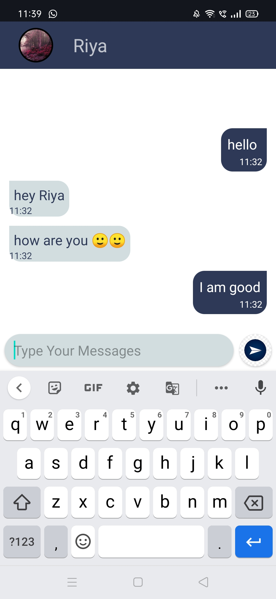

# Chat-App-Android

An app for chatting in two persons is created using FireBase where User Registration is done  and messages are also stored in firebase server. Recycler View and UserDefined Adapter are used to display list of all the users .
 

 
  <ul>
    <li> 1. SignUp and LogIn Pages [Image 1,2]
    <li> UserList (All users registered on this App) [Image 3]
    <li> Chat Room [Image 4-7]
    <li> Setting (To change userName,ProfilePic,Status) [Page 8]
   </ul> 
  

 

 
 

 

